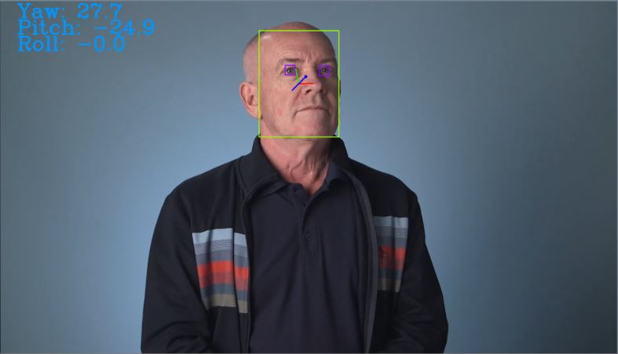
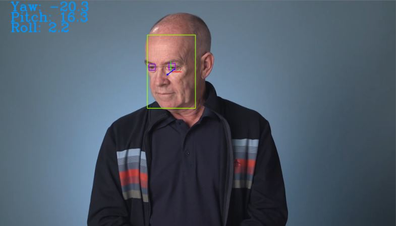

# Computer Pointer Controller

This application is used to control mouse pointer with user's gaze movement using an input video or a livestream webcam.
## Set Up and Installation

### Setup 

#### Install Intel® Distribution of OpenVINO™ toolkit
Project requires OpenVINO installed in your system. See below description and install it.

Requirements based on [OpenVino toolkit](https://docs.openvinotoolkit.org/latest/_docs_install_guides_installing_openvino_windows.html).

* 6th-10th Generation Intel® Core™ processors
* Intel® Xeon® v5 family
* Intel® Xeon® v6 family
* Intel® Pentium® processor N4200/5, N3350/5, N3450/5 with Intel® HD Graphics
* Intel® Movidius™ Neural Compute Stick
* Intel® Neural Compute Stick 2
* Intel® Vision Accelerator Design with Intel® Movidius™ VPUs

Refer the [Link](https://docs.openvinotoolkit.org/latest/_docs_install_guides_installing_openvino_windows.html) for detailed installation.

Note: If the above mentioned requirement is not met, Intel DevCloud can also be used.

##### Initialize OpenVINO Environment 

* For windows (Command prompt):
```
cd C:\Program Files (x86)\IntelSWTools\openvino\bin\
```
```
setupvars.bat
```

### Install Models File (Link to Documentation & downloader commands)

- [Face Detection Model](https://docs.openvinotoolkit.org/latest/_models_intel_face_detection_adas_binary_0001_description_face_detection_adas_binary_0001.html)
```
python "C:\Program Files (x86)\IntelSWTools\openvino\deployment_tools\tools\model_downloader\downloader.py" --name "face-detection-adas-binary-0001" -o "<user directory>\models" 
```
- [Facial Landmarks Detection Model](https://docs.openvinotoolkit.org/latest/_models_intel_landmarks_regression_retail_0009_description_landmarks_regression_retail_0009.html)
```
python "C:\Program Files (x86)\IntelSWTools\openvino\deployment_tools\tools\model_downloader\downloader.py" --name "landmarks-regression-retail-0009" -o "<user directory>\models"
```
- [Head Pose Estimation Model](https://docs.openvinotoolkit.org/latest/_models_intel_head_pose_estimation_adas_0001_description_head_pose_estimation_adas_0001.html)
```
python "C:\Program Files (x86)\IntelSWTools\openvino\deployment_tools\tools\model_downloader\downloader.py" --name "head-pose-estimation-adas-0001" -o "<user directory>\models"
```
- [Gaze Estimation Model](https://docs.openvinotoolkit.org/latest/_models_intel_gaze_estimation_adas_0002_description_gaze_estimation_adas_0002.html)
```
python "C:\Program Files (x86)\IntelSWTools\openvino\deployment_tools\tools\model_downloader\downloader.py" --name "gaze-estimation-adas-0002" -o "<user directory>\models"
```

## Command Line Arguments

Following are command line arguments used by main.py file `python main.py`
```
  1. -fd    (required) : Path to a face detection model xml file.
  2. -fl    (required) : Path to a facial landmarks detection model xml file.
  3. -hp    (required) : Path to a head pose estimation model xml file.
  4. -ge    (required) : Path to a gaze estimation model xml file.
  5. -i     (required) : Path to image or video or CAM.
  6. -l     (optional) : Targeted custom layers (CPU Extension path).
  7. -d     (optional) : Specify the target device (CPU, GPU, FPGA, VPU).
  8. -pt    (optional) : Probability threshold for detections.
  9. -flag  (optional) : Visualize different model output on frame (fd: Face Detection Model, fl: Facial Landmark Detection Model, 
                         hp: Head Pose Estimation Model, ge: Gaze Estimation Model).
```

## Run the App

Change the device (-d) argument for different hardwares. (for example: -d CPU or -d GPU or -d FPGA or -d MYRIAD)

```
python <main.py directory> -fd "<Face detection model name directory>" -fl "<Facial landmark detection model name directory>" -hp "<head pose estimation model name directory>" -ge "<Gaze estimation model name directory>" -i "<input video directory>" -l "<CPU extension>" -d <device>
```

## Structure of directory
```
|
|--bin
    |--demo.mp4
|--models
    |--face-detection-adas-binary-0001
          |--INT1
    |--landmarks-regression-retail-0009
          |--FP16
          |--FP32
    |--head-pose-estimation-adas-0001
          |--FP16
          |--FP32
    |--gaze-estimation-adas-0002
          |--FP16
          |--FP32
|--src
    |--main.py
    |--input_feeder.py
    |--mouse_controller.py
    |--face_detection.py
    |--facial_landmarks_detection.py
    |--head-pose-estimation.py
    |--gaze_estimation.py
|--result
    |--image_1.jpg
    |--image_2.jpg
```

## Demonstration
Use the below command to run the app,

```
python main.py -fd "C:\Program Files (x86)\IntelSWTools\openvino\bin\intel\face-detection-adas-binary-0001\INT1\face-detection-adas-binary-0001" -fl "C:\Program Files (x86)\IntelSWTools\openvino\bin\intel\landmarks-regression-retail-0009\FP16\landmarks-regression-retail-0009" -hp "C:\Program Files (x86)\IntelSWTools\openvino\bin\intel\head-pose-estimation-adas-0001\FP16\head-pose-estimation-adas-0001" -ge "C:\Program Files (x86)\IntelSWTools\openvino\bin\intel\gaze-estimation-adas-0002\FP16\gaze-estimation-adas-0002"  -i demo.mp4 -l "cpu_extension_avx2.dll" -d CPU
```




## Benchmarks
### Results
### Model Performance

I tested all the different performance for different model precisions (FP16/FP32) on CPU device only (since i don't have other devices).
#### FP16 precision
```
python main.py -fd "models\face-detection-adas-binary-0001\INT1\face-detection-adas-binary-0001" -fl "models\landmarks-regression-retail-0009\FP16\landmarks-regression-retail-0009" -hp "models\head-pose-estimation-adas-0001\FP16\head-pose-estimation-adas-0001" -ge "models\gaze-estimation-adas-0002\FP16\gaze-estimation-adas-0002" -i demo.mp4 -l "cpu_extension_avx2.dll" -d CPU
```

* Total loading time: 1.9 seconds
* Total Inference time :  90.7 seconds
* FPS :  0.6504961411245865 frames/second

#### FP32 precision
```
python main.py -fd "models\face-detection-adas-binary-0001\INT1\face-detection-adas-binary-0001" -fl "models\landmarks-regression-retail-0009\FP32\landmarks-regression-retail-0009" -hp "models\head-pose-estimation-adas-0001\FP32\head-pose-estimation-adas-0001" -ge "models\gaze-estimation-adas-0002\FP32\gaze-estimation-adas-0002" -i demo.mp4 -l "cpu_extension_avx2.dll" -d CPU
```

* Total models loading time: 1.79 seconds
* Total Inference time :  90.6 seconds
* FPS :  0.6512141280353201 frames/second

### Inference from results
* The FP32 model has higher precision than FP16 model, hence it provides better accuracy.
* Here in my case, the FP32 model load times are lower than the FP16 load times. This is contrary to what one might assume.
* Here, I have not tested on other hardwares (VPU/GPU/Hybrids) and even then the inference time is good in Intel i7 CPU.

## Stand Out Suggestions
### Edge Cases
* If the lighting of the feed is not proper, the face may not be detected.
* If no face is detected in the current frame, then the app moves on to executing the next frame.
* If there are multiple faces in the input feed, then the first detected face is taken for control over the mouse pointer.
* Sometimes, the mouse movement might be different compared to the expected movement.
